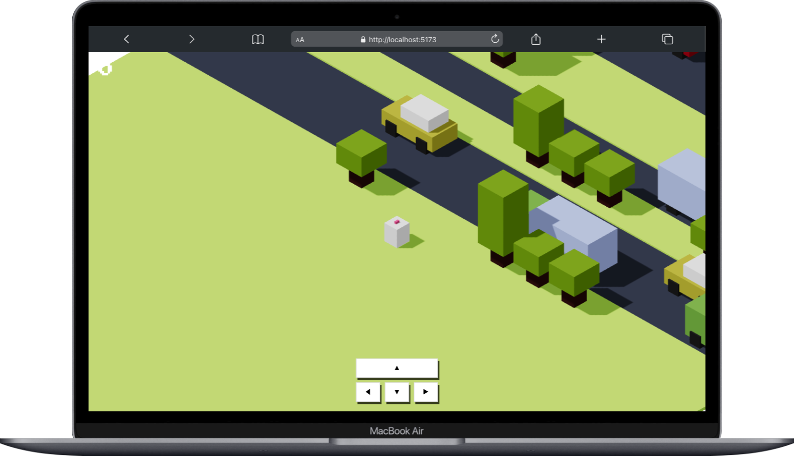

Game introduces using react and threejs to build a game where the character needs to avoid being hit by a car/

# Prerequisites:
- React knowledge
- How global state management works. (Zustan is used here)
- A bit of math for the character movement and the vehicles


## How to run this project:

Switch to the frontend code
```sh
cd crossyroads
```
Install dependencies
```sh
npm install
```
Run the server
```sh
npm run dev
```

# Attributions:
This game follows the tutorial found [here](https://javascriptgametutorials.com/)
